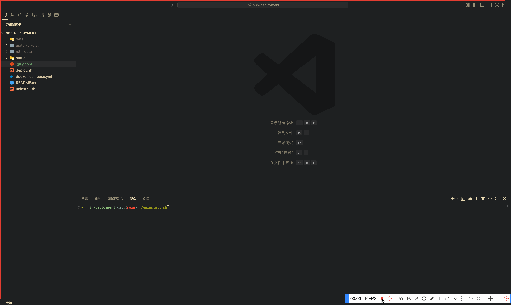

# n8n 汉化版部署指南

## 简介

本文档详细介绍了如何通过 Docker Compose 部署汉化版 n8n，包括中文界面、远程访问、数据持久化和功能增强等优化配置。

## 项目结构

```
n8n-deployment/
├── docker-compose.yml          # Docker Compose 配置文件
├── n8n-data/                   # n8n 数据持久化目录
├── data/                       # 自定义数据目录（支持文件监听节点）
├── editor-ui-dist/             # 汉化界面文件目录
│   └── dist/                   # 解压后的汉化文件
├── deploy.sh                   # 一键部署脚本
├── uninstall.sh                # 卸载脚本
└── DEPLOYMENT.md               # 本部署文档
```

## 一键部署（推荐）

为了简化部署过程，我们提供了一键部署脚本：

```bash
# 添加执行权限
chmod +x deploy.sh

# 运行一键部署
./deploy.sh
```


脚本将自动完成以下操作：
1. 检查 Docker 环境
2. 创建必要的目录结构
3. 下载并解压汉化包
4. 创建 docker-compose.yml 配置文件
5. 启动 n8n 服务

在部署过程中，脚本会提示您选择以下选项：
- 镜像源：可以选择 GitHub 默认源、国内镜像加速 (gh.llkk.cc)、自定义镜像源或不使用镜像加速
- 汉化包版本：可以选择最新发行版或指定版本

## 手动部署步骤

### 1. 准备工作

首先创建必要的目录结构：

```bash
# 创建项目目录（如果尚未创建）
mkdir n8n-deployment
cd n8n-deployment

# 创建数据持久化目录
mkdir -p n8n-data
mkdir -p data

# 创建汉化文件目录
mkdir -p editor-ui-dist
```

### 2. 下载汉化包

进入汉化文件目录并下载中文语言包：

```bash
cd editor-ui-dist
curl -L https://github.com/other-blowsnow/n8n-i18n-chinese/releases/download/n8n%401.99.1/editor-ui.tar.gz -o editor-ui.tar.gz
tar -zxvf editor-ui.tar.gz
rm editor-ui.tar.gz
cd ..
```

### 3. 创建 docker-compose.yml 配置文件

创建 `docker-compose.yml` 文件，内容如下：

```yaml
services:
  n8n-zh:
    image: n8nio/n8n:latest
    container_name: n8n-zh
    ports:
      - "5678:5678"
    environment:
      - N8N_DEFAULT_LOCALE=zh-CN
      - N8N_SECURE_COOKIE=false
      - N8N_HOST=0.0.0.0
      - N8N_RUNNERS_ENABLED=true
    volumes:
      - ./editor-ui-dist/dist:/usr/local/lib/node_modules/n8n/node_modules/n8n-editor-ui/dist
      - ./n8n-data:/home/node/.n8n
      - ./data:/data
    stdin_open: true
    tty: true
    restart: unless-stopped
```

### 4. 启动服务

在 docker-compose.yml 文件所在目录执行：

```bash
docker-compose up -d
```

### 5. 访问 n8n

打开浏览器访问 `http://localhost:5678`，即可看到汉化版的 n8n 界面。

## 配置说明

### 关键环境变量

| 变量名 | 说明 |
|--------|------|
| `N8N_DEFAULT_LOCALE=zh-CN` | 设置默认语言为中文 |
| `N8N_SECURE_COOKIE=false` | 禁用 Cookie 安全检查（仅限本地开发） |
| `N8N_HOST=0.0.0.0` | 允许所有 IP 访问，解除本地访问限制 |
| `N8N_RUNNERS_ENABLED=true` | 启用工作流执行器，增强节点功能支持 |

### 挂载卷说明

| 挂载路径 | 说明 |
|----------|------|
| `./editor-ui-dist/dist:/usr/local/lib/node_modules/n8n/node_modules/n8n-editor-ui/dist` | 挂载汉化界面文件 |
| `./n8n-data:/home/node/.n8n` | 持久化存储工作流数据 |
| `./data:/data` | 自定义目录，支持文件监听节点 |

## 验证部署

1. 访问 `http://localhost:5678`，确认界面为中文
2. 创建一个测试工作流并保存
3. 重启容器后确认工作流数据仍然存在

```bash
# 重启容器
docker-compose restart

# 检查容器状态
docker-compose ps
```

## 卸载 n8n

我们提供了一个卸载脚本来帮助您清理环境：

```
# 添加执行权限
chmod +x uninstall.sh

# 运行卸载脚本
./uninstall.sh
```



脚本将询问您是否要删除数据目录，您可以根据需要选择是否保留数据。

## 常见问题排查

### 无法访问 n8n 界面

- 确认端口映射正确（5678:5678）
- 检查 N8N_HOST 是否为 0.0.0.0
- 确保防火墙允许 5678 端口

### 工作流数据丢失

- 确认 volumes 配置正确，n8n_data 卷已挂载
- 检查 ./data 目录权限，确保容器可读写

### 部分节点功能受限

- 确保挂载 ./data:/data 目录
- 确认 N8N_RUNNERS_ENABLED=true 已启用

## 总结

通过以上配置，n8n 汉化版实现了以下优势：

1. **中文界面**：默认显示中文界面，降低使用门槛
2. **远程访问**：通过 N8N_HOST=0.0.0.0 设置，支持从任意 IP 访问
3. **数据持久化**：工作流数据存储在本地目录，升级或重启不丢失
4. **功能增强**：启用工作流执行器，支持更多节点功能（如文件监听）

此方案适用于开发测试和生产环境，相比官方默认部署提供了更好的用户体验和功能支持。